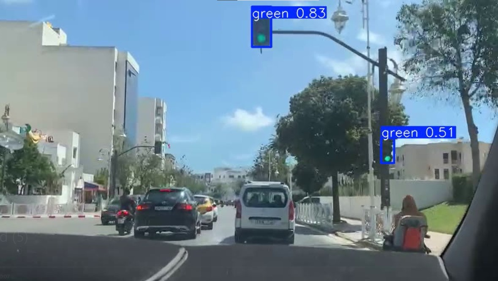

# 🚦 Traffic Light Detection using YOLO

This project implements a deep learning pipeline for **traffic light detection** using the YOLO model family.

## 📌 Features
- Detects traffic lights in images and video streams
- Uses YOLO with custom training parameters
- Includes data augmentation and training utilities
- Organized project structure for reproducibility

## 📂 Project Structure
- `data/` → Sample dataset (not included here)
- `src/` → Source code (dataset, model, training, prediction)
- `notebooks/` → Jupyter notebooks for experimentation
- `output/` → Training results, sample outputs
- `requirements.txt` → Dependencies

## ⚙️ Installation
```bash
git clone https://github.com/username/traffic-light-detection.git
cd traffic-light-detection
pip install -r requirements.txt
```

## 🏃 Usage
```bash
python src/train.py
```

## 📊 Results
Example output:



## 📜 License
MIT License
